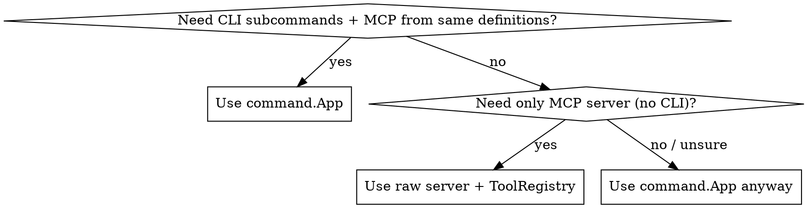

# Go CLI and MCP Framework

`go-lib-mcp` (`github.com/amarbel-llc/go-lib-mcp`) is a zero-dependency Go library for building MCP servers and CLI tools. It provides two layers: a high-level `command` package that generates CLI parsing, MCP registration, plugin manifests, manpages, and shell completions from a single definition, and low-level packages for building MCP servers directly.

For framework orientation and when to use each skill, see the **bob:overview** skill.
For detailed context-saving patterns (pagination/truncation), see the **bob:context-saving** skill.
For packaging your tool for distribution via purse-first, see the **bob:creating-packages** skill.

## Which Layer?



**Default to `command.App`** unless you are building a pure MCP server with no CLI surface. The `command` layer adds no overhead and generates artifacts for free.

## Layer 1: command.App (Recommended)

Define commands once, get CLI + MCP + completions + manpages + plugin manifests.

### Quick Reference

| Type | Purpose |
|------|---------|
| `command.App` | Top-level application container with command registry |
| `command.Command` | Single subcommand with params, descriptions, tool mappings, and RunMCP handler |
| `command.Param` | Parameter declaration (name, type, description, required, default, completer) |
| `command.ParamType` | `String`, `Int`, `Bool`, `Float`, `Array` |
| `command.Description` | Short (one-line) and Long (paragraph) descriptions |
| `command.ToolMapping` | Tool interception declarations: Bash command prefixes, file extensions, or both |

### Pattern

```go
import "github.com/amarbel-llc/go-lib-mcp/command"

// 1. Create app
app := command.NewApp("my-tool", "Short description")
app.Version = "0.1.0"

// 2. Add commands
app.AddCommand(&command.Command{
    Name:        "status",
    Description: command.Description{Short: "Show status"},
    Params: []command.Param{
        {Name: "path", Type: command.String, Description: "Target path", Required: true},
    },
    MapsTools: []command.ToolMapping{
        {Replaces: "Bash", CommandPrefixes: []string{"my-tool status"}, UseWhen: "checking status"},
    },
    RunMCP: func(ctx context.Context, args json.RawMessage) (*protocol.ToolCallResult, error) {
        var p struct{ Path string `json:"path"` }
        json.Unmarshal(args, &p)
        // ... implementation
        return &protocol.ToolCallResult{
            Content: []protocol.ContentBlock{protocol.TextContent("ok")},
        }, nil
    },
})

// 3. Register as MCP tools
registry := server.NewToolRegistry()
app.RegisterMCPTools(registry)

// 4. Generate all artifacts (plugin, mappings, manpages, completions)
app.GenerateAll(outputDir)
```

Key methods on `App`: `AddCommand`, `GetCommand`, `AllCommands`, `VisibleCommands`, `MergeWithPrefix`, `RegisterMCPTools`, `GenerateAll`, `GeneratePlugin`, `GenerateMappings`, `GenerateManpages`, `GenerateCompletions`.

## Layer 2: Raw Server

Build an MCP server directly using provider interfaces and registries.

### Quick Reference

| Package | Purpose |
|---------|---------|
| `server` | Server lifecycle, provider interfaces, registry helpers |
| `protocol` | MCP types: Tool, Resource, Prompt, ContentBlock, ToolCallResult |
| `transport` | Transport interface, Stdio (newline-delimited JSON) |
| `output` | Context-saving: ArrayLimits/LimitArray, TextLimits/LimitText, Defaults |
| `purse` | Plugin manifest and mapping builders for purse-first integration |
| `executor` | Process management abstraction (with Nix support) |

### Pattern

```go
import (
    "github.com/amarbel-llc/go-lib-mcp/server"
    "github.com/amarbel-llc/go-lib-mcp/transport"
    "github.com/amarbel-llc/go-lib-mcp/protocol"
)

// 1. Create registries
tools := server.NewToolRegistry()
tools.Register("echo", "Echoes back the message",
    json.RawMessage(`{"type":"object","properties":{"message":{"type":"string"}},"required":["message"]}`),
    func(ctx context.Context, args json.RawMessage) (*protocol.ToolCallResult, error) {
        var p struct{ Message string `json:"message"` }
        json.Unmarshal(args, &p)
        return &protocol.ToolCallResult{
            Content: []protocol.ContentBlock{protocol.TextContent(p.Message)},
        }, nil
    },
)

// 2. Create and run server
t := transport.NewStdio(os.Stdin, os.Stdout)
srv, _ := server.New(t, server.Options{
    ServerName: "my-server",
    Tools:      tools,
    // Resources: resources,  // optional
    // Prompts:   prompts,    // optional
})
srv.Run(context.Background())
```

Provider interfaces: `ToolProvider`, `ResourceProvider`, `PromptProvider`. Implement directly or use `ToolRegistry`, `ResourceRegistry`, `PromptRegistry` helpers.

## Context-Saving in Go

The `output` package provides Go implementations of the context-saving patterns. Use these in `RunMCP` handlers.

| Function | Use For | Parameters |
|----------|---------|------------|
| `output.LimitArray[T]` | Paginating array results | `ArrayLimits{Offset, Limit}` |
| `output.LimitText` | Truncating text/JSON output | `TextLimits{Head, Tail, MaxLines, MaxBytes}` |
| `output.StandardDefaults()` | Default limits (100KB, 2000 lines, 100 items) | n/a |

```go
defaults := output.StandardDefaults()
limits := defaults.MergeArrayLimits(output.ArrayLimits{Offset: offset, Limit: limit})
result := output.LimitArray(items, limits)
// result.Items, result.Pagination.HasMore, result.TotalCount
```

For detailed context-saving patterns, see the **bob:context-saving** skill.

## Plugin Integration

To ship a `command.App`-based tool as a purse-first plugin, use `app.GenerateAll(outputDir)` in a `postInstall` step or hidden `generate-plugin` subcommand. For full plugin integration guidance, see the **bob:creating-packages** skill.

## Reference Files

- **`references/api-reference.md`** -- Complete type signatures, method docs, and interface definitions for all packages
- **`examples/command-app.go`** -- Full command.App example with CLI + MCP + artifact generation
- **`examples/raw-server.go`** -- Full raw server example with tools, resources, and prompts

## Related Skills

- **bob:context-saving** — Detailed pagination and truncation patterns for MCP tools
- **bob:creating-packages** — Packaging your tool for distribution via purse-first
- **bob:overview** — Framework orientation, terminology, and workflow overview
- **bob:using-packages** — How installed packages work at runtime
